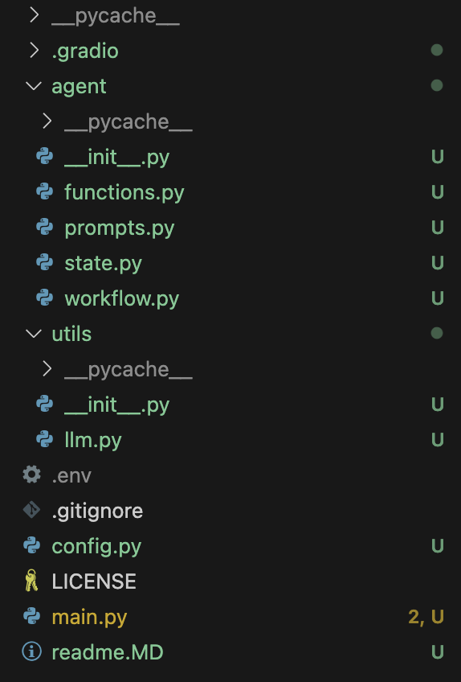
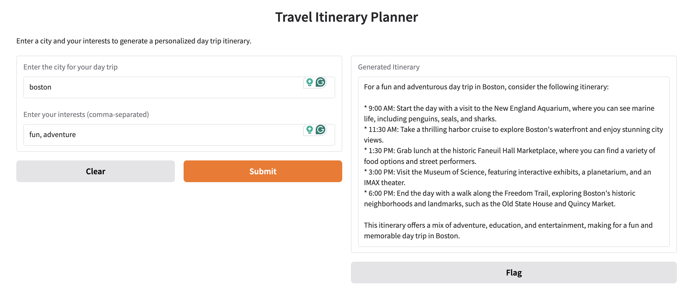

# Multi-Agent Travel Itinerary Planner

This project is an AI-powered travel itinerary planner that uses LangGraph to orchestrate a multi-step process for generating personalized day trip itineraries. It leverages a Large Language Model (LLM) to create the itinerary based on user-provided cities and interests, and provides a user-friendly Gradio interface for interaction.

## Features

* **Interactive Interface:** A Gradio-based web interface allows users to easily input the destination city and their interests.
    
* **AI-Powered Itinerary Generation:** The LLM generates a detailed day trip itinerary, considering the specified location and interests.
    
* **Modular Design:** The codebase is structured into modular components for maintainability and scalability.
    
* **LangGraph Orchestration:** LangGraph is used to define the workflow of the itinerary planning process.

## Project Structure
Here's a visual representation of the project's file structure:
<div align="left">
    
</div>

## Requirements

* Python 3.6 or higher
* pip
* Required Python packages (see `requirements.txt`)

## Setup

1.  **Clone the repository:**

    ```bash
    git clone https://github.com/Prudhvivuda/multi-agent-travel-itinerary-planner.git
    cd multi-agent-travel-itinerary-planner
    ```

2.  **(Optional) Create a virtual environment:**

    ```bash
    python3 -m venv venv
    source venv/bin/activate  # On Linux/macOS
    venv\Scripts\activate  # On Windows
    ```

3.  **Install the required packages:**

    ```bash
    pip install -r requirements.txt
    ```

4.  **Configure the LLM API Key:**

    * Set the `GROQ_API_KEY` environment variable. You can do this in a `.env` file (recommended for local development) or directly in your shell.
    * Example `.env` file:

        ```
        GROQ_API_KEY=YOUR_API_KEY
        ```

## Usage

### Running the Gradio Interface

To start the interactive Gradio interface, run the following command from the project root:

```bash
python main.py
```

## Example
<div align="left">
    
</div>